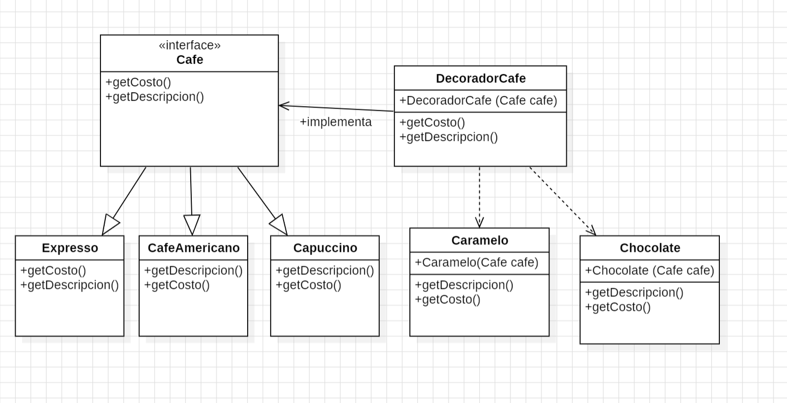

# Practica Lab14

Elaboración del patron Decorator con la implementacion de una tienda de cafe en linea

## Descripción:
Se ha implementado el caso de venta en linea de una Cafeteria que contiene las siguientes clases:

- Cafe (interfaz)
- Expreso
- Capuccino
- CafeAmericano
- DecoradorCafe
- Caramelo
- Chocolate 
- Main

Diagrama: 

